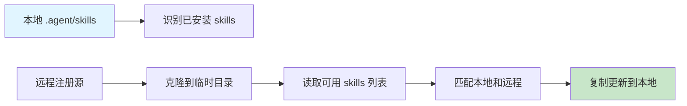

# Skill Manager

> Agent Skills 的包管理器。支持列出、安装和更新来自远程 Git 仓库的 skills。

[](https://www.python.org/downloads/)
[](LICENSE)

---

## 功能特性

- **📦 包管理** - 类似 npm/pip 的包管理体验
- **🔍 发现** - 列出远程仓库中所有可用的 skills
- **⬇️ 安装** - 一键安装任意 skill 到本地
- **🔄 更新** - 批量更新已安装的 skills
- **⚙️ 可配置** - 支持多个注册源（registries）

---

## 快速开始

### 基本使用

```bash
# 列出所有可用的 skills
python scripts/manager.py list

# 安装一个 skill
python scripts/manager.py install git-history-cleaner

# 更新所有已安装的 skills
python scripts/manager.py update
```

### 作为 Python 模块运行

```bash
cd skills/skill-manager
python -m scripts list
python -m scripts install git-history-cleaner
python -m scripts update
```

---

## 项目结构

```
skill-manager/
├── SKILL.md              # 核心 skill 文档
├── README.md             # 项目说明（本文件）
├── config/
│   └── sources.json      # 注册源配置
└── scripts/
    ├── __init__.py       # 包入口
    ├── __main__.py       # 支持 python -m
    └── manager.py        # 主程序逻辑
```

---

## 配置

注册源配置存储在 `config/sources.json`：

```json
{
  "registries": [
    {
      "name": "cc-skills",
      "url": "https://github.com/volcanicll/cc-skills",
      "branch": "main",
      "skills_root": "skills",
      "priority": 100
    }
  ]
}
```

### 配置说明

| 字段 | 说明 | 示例 |
|------|------|------|
| `name` | 注册源名称 | `"cc-skills"` |
| `url` | Git 仓库 URL | `"https://github.com/user/repo"` |
| `branch` | 分支名 | `"main"` |
| `skills_root` | skills 目录相对路径 | `"skills"` |
| `priority` | 优先级（数字越大越优先） | `100` |

---

## 命令

### list - 列出可用的 skills

```bash
python scripts/manager.py list
```

输出示例：

```
🔍 Available Skills in Remote Registries:

📦 Registry: cc-skills
  - git-history-cleaner              ✅ Installed
  - skill-manager                  ✅ Installed
  - example-skill                     Available
```

### install - 安装 skill

```bash
# 基本安装
python scripts/manager.py install git-history-cleaner

# 强制覆盖安装
python scripts/manager.py install git-history-cleaner --force
```

### update - 更新所有 skills

```bash
python scripts/manager.py update
```

输出示例：

```
🚀 Updating all installed skills...

📋 Local skills identified: 2
   ✅ Updated: git-history-cleaner
   ✅ Updated: skill-manager

✨ Update complete. 2 skills processed.
```

---

## 工作原理



1. **识别本地 skills** - 扫描 `.agent/skills` 目录
2. **克隆远程仓库** - 浅克隆（`--depth 1`）到临时目录
3. **匹配更新** - 对比本地和远程，复制更新的 skills
4. **清理** - 删除临时目录

---

## 作为 Python 模块使用

### 命令行方式

```bash
cd skills/skill-manager
python -m scripts list
python -m scripts install <skill-name>
python -m scripts update
```

### 代码导入方式

```python
from skill_manager import SkillManager

manager = SkillManager()

# 列出可用的 skills
manager.list_skills()

# 安装 skill
manager.install_skill("git-history-cleaner")

# 强制重新安装
manager.install_skill("git-history-cleaner", force=True)

# 更新所有已安装的 skills
manager.update_all()
```

---

## 工作流示例

### 场景 1：首次设置

```bash
# 1. 查看有哪些可用的 skills
python scripts/manager.py list

# 2. 安装需要的 skills
python scripts/manager.py install git-history-cleaner
python scripts/manager.py install code-review
```

### 场景 2：定期更新

```bash
# 每周运行一次，更新所有已安装的 skills
python scripts/manager.py update
```

### 场景 3：重新安装 skill

```bash
# 强制覆盖本地 skill
python scripts/manager.py install git-history-cleaner --force
```

---

## 目录结构

Skill Manager 假设以下目录结构：

```
# 本地 skills 目录（目标）
.agent/skills/
├── git-history-cleaner/
├── skill-manager/
└── other-skill/

# 远程仓库结构（源）
github.com/user/cc-skills/
├── skills/
│   ├── git-history-cleaner/
│   ├── skill-manager/
│   └── other-skill/
```

---

## 故障排除

### Q: 找不到配置文件

**A**: 确保 `config/sources.json` 存在且格式正确：

```bash
cat config/sources.json
```

### Q: Git clone 失败

**A**: 检查网络连接和仓库 URL 是否正确：

```bash
git clone https://github.com/volcanicll/cc-skills
```

### Q: Skill 已存在提示

**A**: 使用 `--force` 参数强制覆盖：

```bash
python scripts/manager.py install <skill-name> --force
```

### Q: 更新后 skill 没有变化

**A**: 确认远程仓库有新提交。使用 `--force` 强制更新：

```bash
python scripts/manager.py install <skill-name> --force
```

---

## 贡献

欢迎提交 Issue 和 Pull Request！

---

## 许可证

MIT License

---

## 作者

Craft Agent Skills Team

---

**相关链接**: [SKILL.md](SKILL.md) | [配置文件](config/sources.json)
